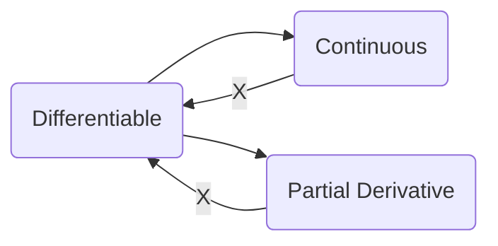

# Chapter 8 The Differential Calculus of Functions of Several Variables

## 8.1 The Linear Structure on $\mathbb{R}^m$

### 8.1.1 $\mathbb{R}^m$ as a Vector Space

### 8.1.2 Linear Transformations $L:\mathbb{R}^m\mapsto\mathbb{R}^n$

### 8.1.3 The Norm in $\mathbb{R}^m$

### 8.1.4 The Euclidean Structure on $\mathbb{R}^m$

Any linear function $L:\mathbb{R}^m\mapsto\mathbb{R}$ in Euclidean space has the form:
$$
L(x)=\langle\xi,x\rangle
$$
where $\xi\in\mathbb{R}^m$ is a fixed vector determined uniquely by the function $L$.

## 8.2 The Differential of a Function of Several Variables

### 8.2.1 Differentiability and the Differential of a Function at a Point

**Definition 1**: A function $f:E\mapsto\mathbb{R}^n$ defined on a set $E\subset\mathbb{R}^m$ is *differentiable* at the point $x\in{E}$, which is a limit point of $E$, if:
$$
f(x+h)-f(x)=L(x)h+\alpha(x;h)
$$
where $L(x):\mathbb{R}^m\mapsto\mathbb{R}^n$ is a function that is linear in $h$ and $\alpha(x;h)=o(h)$ as $h\to0,x+h\in{E}$.

**Increment of the argument**: $\Delta{x}(h)\gets(x+h)-x=h$. A function of $h$.

**Increment of the function**: $\Delta{f}(x;h)\gets f(x+h)-f(x)$. A function of $x$ and $h$.

$L(x)$ is **differential**, tangent mapping, or derivative mapping of the function $f$ at point $x$, often denoted by $\mathrm{d}f(x)$:
$$
\Delta{f}(x;h)=\mathrm{d}f(x)h+\alpha(x;h)
$$
$T\mathbb{R}_x^m$ is the **tangent space** to $\mathbb{R}^m$ at $x\in\mathbb{R}^m$. $\mathrm{d}f:T\mathbb{R}_x^m\mapsto T\mathbb{R}_{f(x)}^m$ is a linear transformation.

>  The value of the differential on a vector $h\in T\mathbb{R}_x^m$ is the vector $\mathrm{d}f(x)h\in T\mathbb{R}_{f(x)}^m$ attached to the point $f(x)$ and approximating the increment $f(x+h)-f(x)$ of the function caused by the increment $h$ of the argument $x$.

### 8.2.2 The Differential and Partial Derivatives of a Real-Valued Function

**Proposition 1**: A mapping $f:E\mapsto\mathbb{R}^n$ of a set $E\subset\mathbb{R}^m$ is differentiable at a point $x\in{E}$ that is a limit point of $E$ if and only if the functions $f^i:E\mapsto\mathbb{R}$ that define the coordinate representation of the mapping are differentiable at that point.
$$
f^i(x+h)-f^i(x)=L^i(x)h+\alpha^i(x;h)
$$
<u>Now let's consider $f:E\mapsto\mathbb{R}$, $E\in\mathbb{R}^m$ and differentiable at an interior point $x\in{E}$ of that set.</u> Then the definition 1 can be rewritten as:
$$
f(x^1+h^1,\dots,x^m+h^m)-f(x^1,\dots,x^m)=a_1(x)h^1+\dots+a_m(x)h^m+o(h)
$$
Let $h_i=h^ie_i$, then:
$$
a_i(x)=\lim_{h^i\to0}\frac{f(x^1,\dots,x^{i-1},{\color{red}x^i+h^i},x^{i+1},\dots,x^m)-f(x^1,\dots,{\color{red}h^i},\dots,x^m)}{h^i}
$$
**Definition 2**: The limit above is called the *partial derivative* of the function $f(x)$ at the point $x=(x_1,\dots, x_m)$ with respect to the variable $x^i$.

**Proposition 2**: If a function $f:E\mapsto\mathbb{R}^n$ defined on a set $E\subset\mathbb{R}^m$ is differentiable at an interior point $x\in{E}$ of that set, then the function has a partial derivative at that point with respect to each variable, and the differential of the function is uniquely determined by these partial derivatives in the form:
$$
\mathrm{d}f(x)h=\frac{\partial{f}}{\partial{x^1}}(x)h^1+\cdots+\frac{\partial{f}}{\partial{x^m}}(x)h^m
$$
For the function $\pi^i(x^1,\dots,x^m)=x^i$, we have:
$$
\Delta\pi^i(x;h)=\pi(x+h)-\pi(x)=(x^i+h^i)-x^i=h^i=\mathrm{d}\pi^i(x)h
$$
Rename $\pi^i(x)$ as $x^i(x)$, we find that $\mathrm{d}\pi^i(x)h=\mathrm{d}x^i(x)h=h^i$.

We can now *represent the differential of any function as a linear combination of the differentials of the coordinates of its argument $x$*:
$$
\mathrm{d}f(x)=\frac{\partial{f}}{\partial{x^1}}x^1+\cdots+\frac{\partial{f}}{\partial{x^m}}x^m
$$

### 8.2.3 Coordinate Representation of the Differential of a Mapping. The Jacobi Matrix

Now $f:E\mapsto\mathbb{R}^n$, $E\in\mathbb{R}^m$, the coordinate representation of the differential is:
$$
\begin{align*}
\mathrm{d}f(x)h&=\begin{bmatrix}\mathrm{d}f^1(x)h\\\vdots\\\mathrm{d}f^n(x)h\end{bmatrix}\\
&=\begin{bmatrix}\frac{\partial{f^1}}{\partial{x^1}}(x)&\cdots&\frac{\partial{f^1}}{\partial{x^m}}(x)\\\vdots&\ddots&\vdots\\\frac{\partial{f^n}}{\partial{x^1}}(x)&\cdots&\frac{\partial{f^n}}{\partial{x^m}}(x)\end{bmatrix}\begin{bmatrix}h^1\\\vdots\\h^m\end{bmatrix}\\
\end{align*}
$$
**Definition 3**: The matrix $[\partial_if^j(x)]_{ij}$ of partial derivatives of the coordinate functions of a given mapping at the point $x\in{E}$ is called the *Jacobian* of the mapping at the point.

**Proposition 3**: If a mapping $f:E\mapsto\mathbb{R}^n$ of a set $E\subset\mathbb{R}^m$ is differentiable at an interior point $x\in{E}$, then it has a unique differential $\mathrm{d}f(x)$ at that point, and the coordinate representation of the mapping $\mathrm{d}f(x):T\mathbb{R}_x^m\mapsto T\mathbb{R}_{f(x)}^m$ is given by equation above.

### 8.2.4 Continuity, Partial Derivatives, and Differentiability of a Function at a Point

## 8.3 The Basic Laws of Differentiation

### 8.3.1 Linearity of the Operation of Differentiation

**Theorem 1**: If the mappings $f_1:E\mapsto\mathbb{R}^n$ and $f_2:E\mapsto\mathbb{R}^n$, defined on a set $E\subset\mathbb{R}^m$, are differentiable at a point $x\in{E}$, then a linear combination of them $\lambda_1f_1+\lambda_2f_2:E\mapsto\mathbb{R}^n$ is also differentiable at that point, and the following equality holds:
$$
\mathrm{d}(\lambda_1f_1+\lambda_2f_2)=\lambda_1\mathrm{d}f_1+\lambda_2\mathrm{d}f_2
$$
**Theorem 2**: If the functions $f:E\mapsto\mathbb{R}$ and $g:E\mapsto\mathbb{R}$, defined on a set $E\subset\mathbb{R}^m$, are differentiable at the point $x\in{E}$, then:

(a) their product is differentiable at $x$ and:
$$
\mathrm{d}(f\cdot g)=g\mathrm{d}f+f\mathrm{d}g
$$
(b) their quotient is differentiable at $x$ if $g(x)\ne0$, and:
$$
\mathrm{d}\biggl(\frac{f}{g}\biggr)=\frac{1}{g^2}(g\mathrm{d}f-f\mathrm{d}g)
$$
For $f:E\mapsto\mathbb{R}^n,E\in\mathbb{R}^m$:
$$
\partial_i(\lambda_1f_1^j+\lambda_2f_2^j)=\lambda_1\partial_if_1^j+\lambda_2\partial_if_2^j\\
\partial_i(f\cdot g)=g\partial_if+f\partial_ig\\
\partial_i\biggl(\frac{f}{g}\biggr)=\frac{1}{g^2}(g\partial_if-f\partial_ig)
$$

### 8.3.2 Differentiation of a Composition of Mappings (Chain Rule)

#### a. The Main Theorem

**Theorem 3**: If the mapping $f:X\mapsto{Y}$ of a set $X\subset\mathbb{R}^m$ into a set $Y\subset\mathbb{R}^n$ is differentiable at a point $x\in{X}$, and the mapping $g:Y\mapsto\mathbb{R}^k$ is differentiable at the point $y=f(x)\in{Y}$, then their composition $g\circ{f}:X\mapsto\mathbb{R}^k$ is differentiable at $x$ and the differential $\mathrm{d}(g\circ{f}):T\mathbb{R}_x^m\mapsto T\mathbb{R}_{g(f(x))}^m$ of the composition equals the composition $\mathrm{d}g(y)\circ\mathrm{d}f(x)$ of the differentials.

Proof:
$$
\begin{align*}
&(g\circ f)(x+h)-(g\circ f)(x)\\
&=g(f(x+h))-g(f(x))\\
&=\mathrm{d}g(f(x))[f(x+h)-f(x)]+o(f(x+h)-f(x))\\
&=\mathrm{d}g(y)(\mathrm{d}f(x)h+o(h))+o(f(x+h)-f(x))\\
&=\mathrm{d}g(y)\mathrm{d}f(x)h+\mathrm{d}g(y)o(h)+o(f(x+h)-f(x))\\
&=\mathrm{d}g(y)\mathrm{d}f(x)h+\alpha(x;h)\\
\end{align*}
$$
Since:
$$
\begin{align*}
\alpha(x;h)&=\mathrm{d}g(y)o(h)+o(f(x+h)-f(x))\\
&=o(h)+o(\mathrm{d}f(x)h+o(h))\\
&=o(h)+o(h)=o(h)
\end{align*}
$$
Then done.

In coordinate form:
$$
\begin{align*}
\mathrm{d}(g\circ f)(x)&=\begin{bmatrix}\partial_1(g^1\circ f)(x)&\cdots&\partial_m(g^1\circ f)(x)\\\vdots&\ddots&\vdots\\\partial_1(g^k\circ f)(x)&\cdots&\partial_m(g^k\circ f)(x)\end{bmatrix}\\
&=\begin{bmatrix}\partial_1g^1(y)&\cdots&\partial_ng^1(y)\\\vdots&\ddots&\vdots\\\partial_1g^k(y)&\cdots&\partial_ng^k(y)\end{bmatrix}
\begin{bmatrix}\partial_1f^1(x)&\cdots&\partial_mf^1(x)\\\vdots&\ddots&\vdots\\\partial_1f^n(x)&\cdots&\partial_mf^n(x)\end{bmatrix}\\
&=\partial_lg^i(f(x))\cdot\partial_jf^l(x)\\
&1\le i\le k,1\le j\le m,1\le l\le n
\end{align*}
$$

#### b. The Differential and Partial Derivatives of a Composite Real-Valued Function

For real-value function, the partial derivative of the composition of the mappings $f:X\mapsto{Y}$ and $g:Y\mapsto\mathbb{R}$, since $k=1$, then:
$$
\partial_j(g\circ f)(x)=\partial_lg(f(x))\cdot\partial_jf^l(x)
$$

#### c. The Derivative with Respect to a Vector and the Gradient of a Function at a Point

**Definition 1**: If the function $f(x)$ is defined in a neighborhood of the point $x_0\in\mathbb{R}^m$ and the vector $v\in T\mathbb{R}_{x_0}^m$ is attached at the point $x_0$, then the quality:
$$
\nabla_{v}f(x_0)=\lim_{t\to0}\frac{f(x_0+vt)-f(x_0)}{t}
$$
(if the indicated limit exists) is called the derivative of $f$ at the point $x_0$ with respect to the vector $v$ or the derivative along the vector $v$ at the point $x_0$.

In coordinate form:
$$
\nabla_{v}f(x_0)=\partial_if(x_0)v^i
$$
this holds for the function $f$ is differentiable at the point $x_0$.

Also, thanks to virtue of the linearity of the differential $\mathrm{d}f(x_0)$:
$$
\nabla_{\lambda_1v_1+\lambda_2v_2}f(x_0)=\lambda_1\nabla_{v_1}f(x_0)+\lambda_2\nabla_{v_2}f(x_0)
$$
If $R^m$ is regarded as a Euclidean space, then it is possible to write any linear functional $L(v)$ as the inner product of a fixed vector $\xi$ and the variable vector $v$.
$$
\mathrm{d}f(x_0)v=\langle\xi,v\rangle
$$
**Definition 2**: The vector in $\xi\in T\mathbb{R}_{x_0}^m$ corresponding to the differential $\mathrm{d}f(x_0)$ of the function $f$ at the point $x_0$ in the sense of inner product is called the *gradient* of the function at that point and is denoted $\nabla{f}(x_0)$.

By definition:
$$
\mathrm{d}f(x_0)v=\langle\nabla{f}(x_0),v\rangle
$$
In the Cartesian coordinate:
$$
\nabla{f}(x_0)=\begin{bmatrix}\partial_1f&\cdots&\partial_mf\end{bmatrix}^T(x_0)
$$
Let $e\in T\mathbb{R}_{x_0}^m$ be a unit vector, then:
$$
\nabla_{e}f(x_0)=\langle\nabla{f}(x_0),e\rangle=\|\nabla{f}(x_0)\|\cos\phi
$$
where $\phi$ is the angle between the vectors $e$ and $\nabla{f}(x_0)$.

That is, the rate of increase of the function $f$ is maximal and equal to $\|\nabla{f}(x_0)\|$ for motion from the point $x_0$ precisely when the displacement is in the direction of the vector $\nabla{f}(x_0)$. The value of the function decreases most sharply under displacement in the opposite direction, and the rate of variation of the function is zero in a direction perpendicular to the vector $\nabla{f}(x_0)$.

The derivative with respect to a unit vector in a given direction is usually called the *directional derivative in that direction*.

### 8.3.3 Differentiation of an Inverse Mapping

**Theorem 4**: Let $f:U(x)\mapsto V(y)$ be a mapping of a neighborhood $U(x)\subset\mathbb{R}^m$ of the point $x$ onto a neighborhood $V(y)\subset\mathbb{R}^m$ of the point $y=f(x)$. Assume that $f$ is continuous at the point $x$ and has an inverse mapping $f^{-1}:V(y)\mapsto U(x)$ that is continuous at the point $y$. Given these assumptions, if the mapping $f$ is differentiable at $x$ and the tangent mapping $\mathrm{d}f(x):T\mathbb{R}_x^m\mapsto T\mathbb{R}_y^m$ to $f$ at the point $x$ has an inverse $[\mathrm{d}f(x)]^{-1}:T\mathbb{R}_y^m\mapsto T\mathbb{R}_x^m$, then the mapping $f^{-1}:V(y)\mapsto U(x)$ is differentiable at the point $y=f(x)$, and the following equality holds:
$$
[\mathrm{d}f]^{-1}(y)=[\mathrm{d}f(x)]^{-1}
$$

#### Proof

### 8.3.4 Problems and Exercises

#### Problem 1

> (a) For any path pass $x_0$:
>
> Reflexive: $x(0)=x(0)=x_0$ and $\mathrm{d}(x(t),x(t))=0$.
>
> Symmetric: Since $x_1(0)=x_2(0)=x_0$ and $\mathrm{d}(x_1(t),x_2(t))=o(t)$, then $x_2(0)=x_1(0)=x_0$ and $\mathrm{d}(x_2(t),x_1(t))=o(t)$.
>
> Transitive: If there are $x_1(t)$, $x_2(t)$ and $x_3(t)$, then $x_1(0)=x_2(0)=x_3(0)=x_0$ and $\mathrm{d}(x_1(t),x_3(t))\le\mathrm{d}(x_1(t),x_2(t))+\mathrm{d}(x_2(t),x_3(t))=o(t)$

> (b) At the neighborhood of $x_0\in\mathbb{R}^m$ if a path has the form $x(t)=x_0+vt+o(t)$, then $x_1(0)=x_2(0)=x_0$ and $\mathrm{d}(x_1(t),x_2(t))=(o(t))^2$. Then there is a one-to-one correspondence between $v$ and equivalence classes of smooth paths at the point $x_0$.

> (c) Linear combination: $\lambda_1x_1(t)+\lambda_2x_2(t)\mapsto \lambda_1v_1+\lambda_2v_2$.

> (d) Yes, works for the Cartesian space.

#### Problem 2

> (a) Drawing, pass.

> (b) Drawing, pass.

> (c) The gradient:
> $$
> \nabla{f}(x,y)=(2x,8y)^T
> $$
> Since all the value of a level set are a constant, then for any connected path in $E$, the rate of variation of the function is zero, which is always perpendicular to the gradient.

> (d) Always moving along the opposite direction of gradient.

> (e) Gradient descent.

#### Problem 3

> (a) Drawing, pass.

> (b) Drawing, pass.

> (c) Pass.

> (d) Nearly the same as Newtonian force field.

#### Problem 4

> (a) 

Page 470
