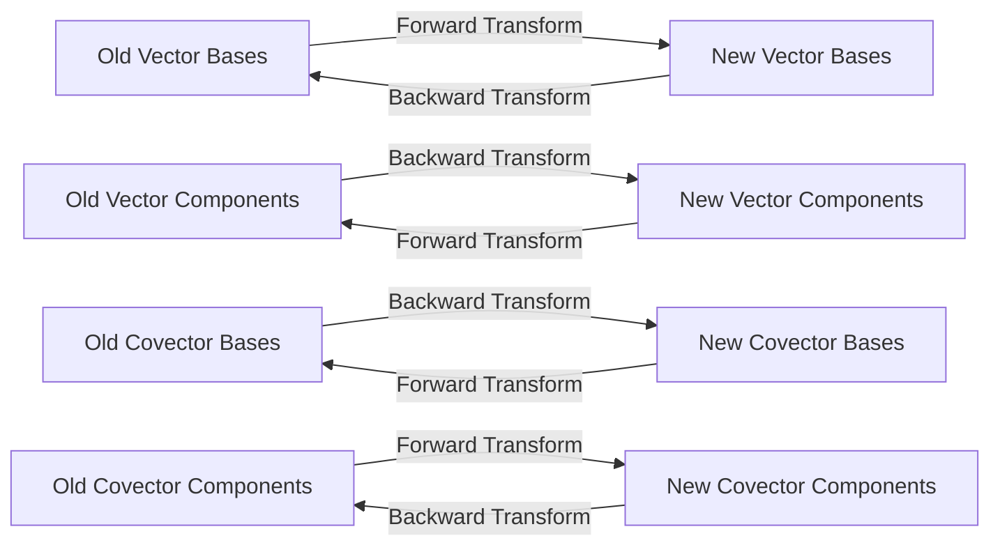

# Tensor for Beginners

## 0 Tensor Definition

<del>Tensor is a multi-dimensional array of numbers.</del>

Tensor is an object that is **invariant** under a change of coordinates, and has **components** that change in a special, predictable way under a change of coordinates.

*Tensors are invariant while their components are variant.*

Tensor is a collection of vectors and covectors combined together using the tensor product.

Tensors as partial derivatives and gradients that transform with the Jacobian Matrix.

## 1 Forward and Backward Transformations

Denote:
$$
\text{Old Basis:}\{\mathbf e_1,\dots\}\quad\text{New Basis:}\{\tilde{\mathbf e}_1,\dots\}
$$

### Forward Transformations

Representing new basis with old basis.
$$
\tilde{\mathbf e}_1=F_{11}\mathbf e_1+F_{21}\mathbf e_2+\dots+F_{n1}\mathbf e_n\\
$$
$$
\color{red}\tilde{\mathbf e}_i=\sum_{j=1}^{n}F_{ji}\mathbf e_j
$$

### Backward Transformations

Representing old basis with new basis.
$$
\color{red}\mathbf e_i=\sum_{j=1}^{n}B_{ji}\tilde{\mathbf e}_j
$$

$$
\begin{align*}
\mathbf e_i&=\sum_{j=1}^{n}B_{ji}\tilde{\mathbf e}_j&\tilde{\mathbf e}_i&=\sum_{j=1}^{n}F_{ji}\mathbf e_j\\
&=\sum_{j=1}^{n}B_{ji}\sum_{k=1}^{n}F_{kj}\mathbf e_k&&=\sum_{j=1}^{n}F_{ji}\sum_{k=1}^{n}B_{kj}\tilde{\mathbf e}_k\\
&=\sum_{k=1}^{n}\sum_{j=1}^{n}B_{ji}F_{kj}\mathbf e_k&&=\sum_{k=1}^{n}\sum_{j=1}^{n}F_{ji}B_{kj}\tilde{\mathbf e}_k\\
&=\sum_{k=1}^{n}\delta_{ik}\mathbf e_k&&=\sum_{k=1}^{n}\delta_{ik}\tilde{\mathbf e}_k
\end{align*}
$$

$$
\delta_{ik}=\sum_{j=1}^{n}B_{ji}F_{kj}=\sum_{j=1}^{n}F_{ji}B_{kj}\\
$$

## 2 Vector

## 3 Vector Transformation Rules

$$
\mathbf v_{\tilde{\mathbf e}_i}=\sum_{i=1}^{n}\tilde{v}^i\tilde{\mathbf e}_i\\
\mathbf v_{\mathbf e_i}=\sum_{i=1}^{n}v^i\mathbf e_i\\
$$

Replace new basis with old basis:
$$
\begin{align*}
\mathbf v&=\sum_{j=1}^{n}v^j\mathbf e_j=\sum_{j=1}^{n}v^j\sum_{i=1}^{n}B_{ij}\tilde{\mathbf e}_i\\
&=\sum_{i=1}^{n}\left(\sum_{j=1}^{n}B_{ij}v^j\right)\tilde{\mathbf e}_i\\
\end{align*}
$$
Therefore:
$$
\color{red}
\begin{align*}
\tilde{v}^i&=\sum_{j=1}^{n}B_{ij}v^j\\
v^i&=\sum_{j=1}^{n}F_{ij}\tilde{v}^j
\end{align*}
$$
We say that vector component are **contravariant**.

## 4 Covector

A function that maps a vector to a real number ($\alpha:V\mapsto\mathbb R$​). The space of all the covector are dual space of origin vector space.

It is a linear map
$$
\alpha(\mathbf{v}+\mathbf{u})=\alpha(\mathbf{v})+\alpha(\mathbf{u})\\
\alpha(n\mathbf{v})=n\alpha(\mathbf{v})
$$
All the covector spans a vector space
$$
(\alpha+\beta)(\mathbf{v})=\alpha(\mathbf{v})+\beta(\mathbf{v})\\
(n\alpha)(\mathbf{v})=n\alpha(\mathbf{v})
$$

## 5 Covector Components

Define dual basis of covector space $\epsilon^i:V\mapsto\mathbb{R}$.
$$
\epsilon^i(\mathbf e_j)=\delta_{ij}
$$
where $\mathbf e_j$ is the standard basis of vector space.

Denote
$$
\text{Old Basis:}\{\epsilon_1,\dots\}\quad\text{New Basis:}\{\tilde{\epsilon}_1,\dots\}
$$

## 6 Covector Transformation Rules 

$$
\begin{align*}
\tilde{\epsilon}^i&=\sum_{j=1}^{n}Q_{ij}\epsilon^j\\
\tilde{\epsilon}^i(\tilde{\mathbf e}_k)&=\sum_{j=1}^{n}Q_{ij}\epsilon^j(\tilde{\mathbf e}_k)\\
\delta_{ik}&=\sum_{j=1}^{n}Q_{ij}\epsilon^j\left(\sum_{l=1}^{n}F_{lk}\mathbf e_l\right)\\
&=\sum_{j=1}^{n}\sum_{l=1}^{n}Q_{ij}F_{lk}\epsilon^j(\mathbf e_l)\\
&=\sum_{j=1}^{n}\sum_{l=1}^{n}Q_{ij}F_{lk}\delta_{jl}\\
&=\sum_{j=1}^{n}Q_{ij}F_{jk}\\
&\Rightarrow Q_{ij}\equiv B_{ij}
\end{align*}
$$

Therefore:
$$
\color{red}\tilde{\epsilon}^i=\sum_{j=1}^nB_{ij}\epsilon^j\\
\color{red}\epsilon^i=\sum_{j=1}^nF_{ij}\tilde{\epsilon}^j\\
$$
Covector component transformation:
$$
\tilde{\alpha}=\sum_{i=1}^n\tilde{\alpha}_i\tilde{\epsilon}^{i}=\sum_{i=1}^n\tilde{\alpha}_i\sum_{j=1}^nB_{ij}\epsilon^j=\sum_{j=1}^n\sum_{i=1}^n\tilde{\alpha}_iB_{ij}\epsilon^j=\sum_{j=1}^n\alpha_j\epsilon^j
$$
Therefore:
$$
\color{red}\alpha_j=\sum_{i=1}^n\tilde{\alpha}_iB_{ij}\\
\color{red}\tilde{\alpha}_j=\sum_{i=1}^n\alpha_iF_{ij}\\
$$

## 7 Linear Map

Linear maps transform vectors, not basis. They are spatial transforms.

### Representing the Linear Map with the Same basis

$$
L(\mathbf e_i)=\sum_{j=1}^{n}L^j_i\mathbf e_j
$$

$$
\mathbf{w}=L(\mathbf{v})=L\left(\sum_{i=1}^nv^i\mathbf{e}_i\right)=\sum_{i=1}^nv^iL\left(\mathbf{e}_i\right)=\sum_{i=1}^nv^i\sum_{j=1}^{n}L^j_i\mathbf e_j=\sum_{i=1}^n\sum_{j=1}^{n}v^iL^j_i\mathbf e_j
$$

## 8 Linear Map Transformation Rules

### Representing the Linear Map with the Different basis

$$
\begin{align*}
L(\tilde{\mathbf e}_i)&=L(\sum_{j=1}^{n}F^j_i\mathbf e_j)\\
\tilde{L}^l_i&=\sum_{j=1}^{n}F^j_iL(\mathbf e_j)\\
&=\sum_{j=1}^{n}F^j_i\sum_{k=1}^{n}L^k_j\mathbf e_k\\
&=\sum_{j=1}^{n}F^j_i\sum_{k=1}^{n}L^k_j\sum_{l=1}^{n}B^l_k\tilde{\mathbf e}_l\\
&=\sum_{j=1}^{n}\sum_{k=1}^{n}\sum_{l=1}^{n}F^j_iL^k_jB^l_k\tilde{\mathbf e}_l\\
\end{align*}
$$

Then (Using Einstein Summation Convention here and later):
$$
\color{red}\tilde{L}^l_i=F^j_iL^k_jB^l_k\\
\color{red}L^t_s=B^i_s\tilde{L}^l_iF^t_l\\
$$

## 9 Metric Tensor

A transformation to convert metric between two basis ($g:V\times V\mapsto\mathbb R$).
$$
\|\mathbf v\|^2=v^iv^j\mathbf e_i\cdot\mathbf e_j=\tilde{v}^i\tilde{v}^j\tilde{\mathbf e}_i\cdot\tilde{\mathbf e}_j
$$
Define the metric tensor as:
$$
g_{ij}=\mathbf e_i\cdot\mathbf e_j
$$
And also:
$$
\begin{align*}
\tilde{g}_{ij}&=\tilde{\mathbf e}_i\cdot\tilde{\mathbf e}_j\\
&=F^k_i\mathbf e_k\cdot F^l_j\mathbf e_l\\
&=F^k_iF^l_jg_{kl}
\end{align*}
$$

## 10 Bilinear Forms

n-form: $V^n\mapsto\mathbb R$.

Covectors are linear forms.

Metric tensors are bilinear forms. But it has also to be positive definite.

## 11 Linear Maps are Vector-Covector Pairs

$\mathbf e_i\otimes\epsilon^j$ is a basis for $V\mapsto V$ space, yes, linear map is a vector space.
$$
L=L^i_j\mathbf e_i\otimes\epsilon^j
$$

## 12 Bilinear Maps are Covector-Covector Pairs

$\epsilon^i\otimes\epsilon^j$ is a basis for bilinear map space.
$$
B=B_{ij}\epsilon^i\otimes\epsilon^j
$$

## 13 Tensor Product and Kronecker Product

Tensor product produces linear map. An operation involving not only component but also tensors.

Kronecker product produces a third tensor. An operation only involving component.

Kronecker product produces the coefficient tensor of tensor product.

## 14 The Tensor Product and Vector/Covector Combinations

When dealing with tensor multiplication for high type tensor, it is hard to determine the order of vector/covector combination.

## 15 Tensor Product Spaces

Tensor product space is a linear space ($V\bigotimes V^*,V^*\bigotimes V^*,\dots$), it contains Multilinear maps, a function that is linear when all inputs except one are held constant.

## 16 Raising/Lowering Indexes

The corresponding covector of vector $\mathbf v$ is $(\mathbf v\cdot\ )$.
$$
\mathbf v\cdot\_ =g(\mathbf v\cdot\_ )=g_{ik}\epsilon^i\epsilon^k(v^j\mathbf e_j)=g_{ij}v^j\epsilon^i
$$
where $g$ is the metric tensor. We define:
$$
v_i=g_{ij}v^j
$$
So that:
$$
\mathbf v\cdot\_ =v_i\epsilon^i
$$
which lowers index.

Define:
$$
g^{ki}g_{ij}=\delta^k_j
$$
where $g^{ki}$ is the inverse metric tensor. Then we can transform covector to vector, which raises index.

## Conclusion

$$
T^{ijk\dots}_{rst\dots}
$$

The superscripts are the contravariance indices. The subscripts are the covariance indices.

$(m,n)$-Tensor is a tensor whose the number of contravariance indices are $m$ and the number of covariance indices are $n$.

### Contravariant (1, 0)-Tensor

$$
\begin{align*}
\tilde{\epsilon}^i=B^i_j\epsilon^j&&\tilde{v}^i=B^i_jv^j\\
\epsilon^i=F^i_j\tilde{\epsilon}^j&&v^i=F^i_j\tilde{v}^j
\end{align*}
$$

### Covariant (0, 1)-Tensor

$$
\begin{align*}
\tilde{\mathbf e}_j=F^i_j\mathbf e_i&&\tilde{\alpha}_j=F^i_j\alpha_i\\
\mathbf e_j=F^i_j\tilde{\mathbf e}_i&&\alpha_j=B^i_j\tilde{\alpha}_i
\end{align*}
$$

### (1, 1)-Tensor

$$
\tilde{L}^i_j=F^l_jL^k_lB^i_k\\
L^i_j=B^l_j\tilde{L}^k_lF^i_k
$$

### (0, 2)-Tensor

$$
\tilde{g}_{ij}=F^k_iF^l_jg_{kl}\\
g_{kl}=B^i_kB^j_l\tilde{g}_{ij}
$$

